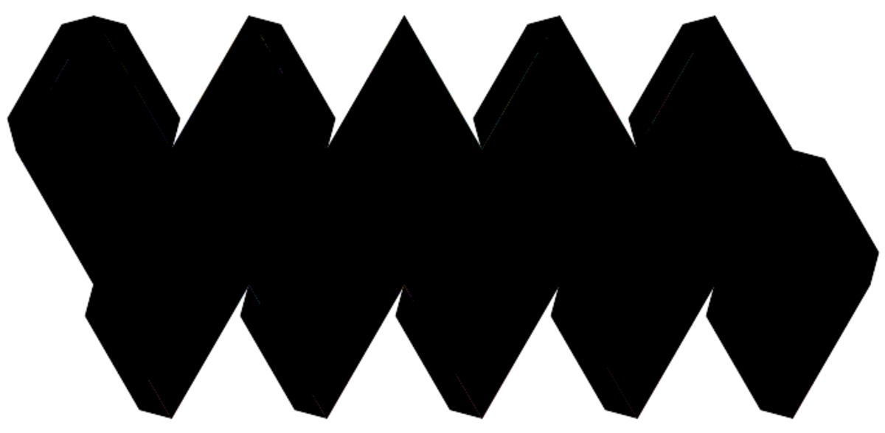

# Icosahedron Map Generator

Generate printable SVG patterns for paper globe construction by projecting world map data onto an icosahedron net.



## Features

- Projects Natural Earth country data onto 20 icosahedron faces
- Gnomonic projection centered on each face for minimal distortion
- Generates a foldable 5-10-5 triangle layout
- Includes latitude/longitude graticule with optional special parallels (equator, polar circles, tropics)
- Flexible orientation: north pole on vertex (default) or face center
- Optional gluing tabs for paper model assembly
- Contrasting country colors for visual distinction
- PDF output with configurable scaling and margins
- Handles antimeridian crossing and polar regions correctly

## Installation

```bash
python -m venv venv
source venv/bin/activate
pip install -r requirements.txt
```

## Usage

```bash
python -m icosahedron_map -o map.svg
```

### Options

#### Output Format
| Option | Description | Default |
|--------|-------------|---------|
| `-o, --output` | Output file path | `icosahedron_map.svg` |
| `--pdf` | Output A4 PDF instead of SVG (landscape orientation) | false |
| `--oblique` | Rotate PDF to maximize size on page (~7% larger) | false |
| `--no-margin` | Remove margins in PDF for tight bounding box | false |
| `--margin-mm` | PDF margin size in millimeters | `0` |

#### Map Data
| Option | Description | Default |
|--------|-------------|---------|
| `-r, --resolution` | Natural Earth resolution (110m, 50m, 10m) | `50m` |
| `-s, --scale` | Triangle edge length in pixels | `100` |

#### Rendering Options
| Option | Description | Default |
|--------|-------------|---------|
| `--lat-step` | Latitude grid spacing in degrees | `15` |
| `--lon-step` | Longitude grid spacing in degrees | `15` |
| `--no-graticule` | Disable latitude/longitude grid | false |
| `--special-parallels` | Show equator, polar circles, and tropics | false |
| `--no-countries` | Disable country rendering | false |
| `--color-countries` | Colorize countries with contrasting colors | false |
| `--no-labels` | Disable face number labels | false |

#### Orientation & Assembly
| Option | Description | Default |
|--------|-------------|---------|
| `--pole-on-face` | Position north pole at face center instead of vertex | false |
| `--tabs` | Add gluing tabs to free edges for paper assembly | false |
| `--tab-size` | Tab height as fraction of edge length | `0.15` |

### Examples

Basic map with default settings:
```bash
python -m icosahedron_map -o map.svg
```

High resolution with fine graticule:
```bash
python -m icosahedron_map -r 10m -s 200 --lat-step 10 --lon-step 10 -o detailed.svg
```

Colorful map with special parallels and gluing tabs (for paper crafts):
```bash
python -m icosahedron_map --color-countries --special-parallels --tabs -o craft.svg
```

Paper globe with north pole at face center:
```bash
python -m icosahedron_map --pole-on-face --color-countries --special-parallels --tabs -s 150 -o globe.svg
```

PDF output for printing (A4 landscape):
```bash
python -m icosahedron_map --color-countries --pdf -o map.pdf
```

PDF output rotated to maximize print size:
```bash
python -m icosahedron_map --color-countries --pdf --oblique -o map_large.pdf
```

Simple outline (graticule only):
```bash
python -m icosahedron_map --no-countries --no-labels --special-parallels -o graticule_only.svg
```

High-detail print-ready version with 10mm margins:
```bash
python -m icosahedron_map --color-countries --special-parallels --tabs --pdf --margin-mm 10 -s 150 -o printable.pdf
```

## Architecture

```
icosahedron_map/
├── geometry/
│   ├── icosahedron.py   # Icosahedron vertices, faces, and coordinate conversion
│   └── unfold.py        # 2D pattern layout (5-10-5 net)
├── projection/
│   ├── gnomonic.py      # Gnomonic projection per face
│   └── face_assignment.py # Spherical Voronoi face assignment
├── rendering/
│   ├── svg_generator.py # SVG output with layers
│   └── graticule.py     # Lat/lon grid generation
├── utils/
│   ├── clipping.py      # Polygon clipping to face boundaries
│   └── coloring.py      # Graph coloring for country colors
└── data/
    └── downloader.py    # Natural Earth data fetching
```

## How It Works

1. **Icosahedron Construction**: Creates a regular icosahedron with vertices and faces. By default, one vertex points to the north pole, but the `--pole-on-face` option rotates it so the north pole aligns with a face center instead.

2. **Coordinate Transformation**: When using `--pole-on-face`, all geographic coordinates are rotated to map the north pole to the face center before processing.

3. **Face Assignment**: Uses spherical Voronoi partitioning to assign each point on Earth to its nearest face center.

4. **Gnomonic Projection**: Projects each face's portion of the globe onto a tangent plane, preserving straight lines (great circles become straight).

5. **Graticule Generation**: Creates latitude/longitude grid lines with optional special parallels:
   - Regular grid at configurable intervals (`--lat-step`, `--lon-step`)
   - Equator (bright red when `--special-parallels` is enabled)
   - Polar circles: Arctic (~66.56°N) and Antarctic (~66.56°S) in blue
   - Tropics: Cancer (~23.44°N) and Capricorn (~23.44°S) in orange

6. **Polygon Clipping**: Clips country polygons to face boundaries, handling antimeridian crossing and polar singularities. Applies coordinate transformation when needed.

7. **Color Assignment**: When `--color-countries` is enabled, uses graph coloring to assign distinct colors to adjacent countries for visual clarity.

8. **Tab Generation**: When `--tabs` is enabled, creates trapezoidal gluing flaps on free edges for paper model assembly.

9. **Pattern Unfolding**: Arranges the 20 triangular faces into a flat 5-10-5 pattern suitable for cutting and folding.

10. **Output Rendering**: Generates SVG with organized layer groups, or converts to PDF for printing with optional rotation and margins.

## License

MIT
